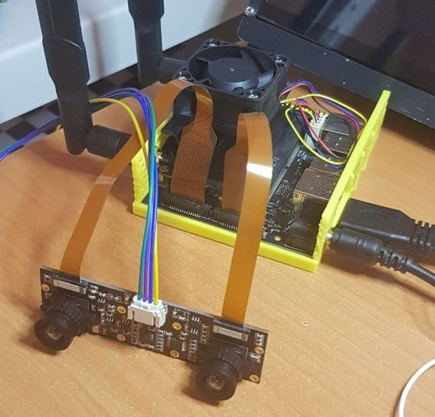
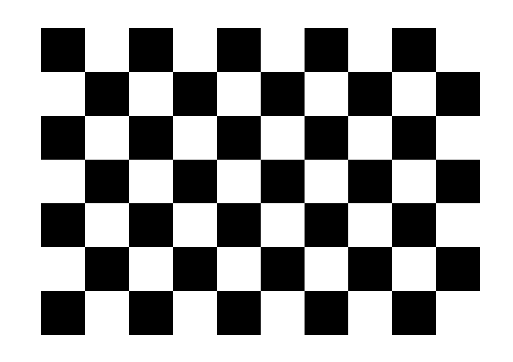
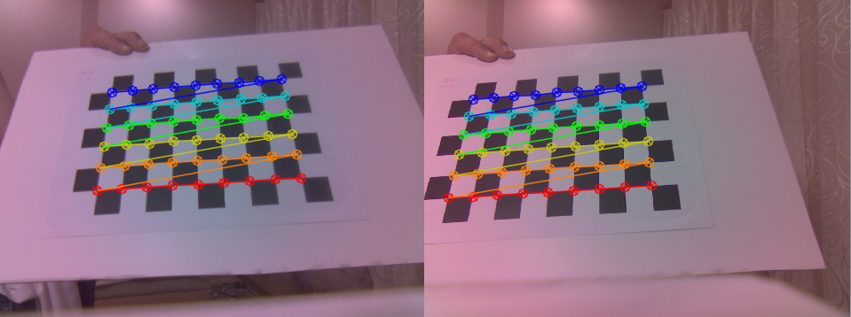
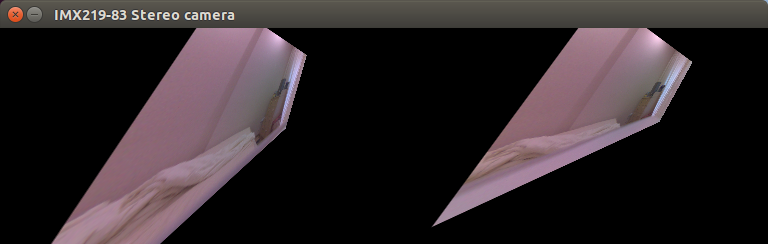

# Jetson-Nano-CSI-Stereo-Vision
## General Info
Calibration and Stereo Vision for <a href="https://developer.nvidia.com/embedded/jetson-nano-developer-kit">Jetson Nano B01</a> and <a href="https://www.waveshare.com/wiki/IMX219-83_Stereo_Camera">IMX219-83 Stereo camera</a>.<br><br>
<br>
## Requirements
Just install JetPack 4.5.1 using Jetson Nano Developer Kit <a href="https://developer.nvidia.com/jetson-nano-sd-card-image">SD Card Image</a>.
## Usage
Clone this repository and run start.py. If you connected everything as in the photo, then nothing needs to be changed.
```
$ git clone https://github.com/ukhov79/Jetson-Nano-CSI-Stereo-Vision
$ cd Jetson-Nano-CSI-Stereo-Vision
$ python3 start.py
```
To start Calibration print chessboard as is (square size 25mm).<br><br>
<br>
When you see the recognized chessboard (below) on the screen,
press 'c' to add points into Calibration info.
Be careful with order of the chessboard corners.
Colors must be in the same order on the left and right cameras.
You need to save about 50 shots of the chessboard in different positions on the screen
and with different rotations.
Then press 's' to save calibration results.<br><br>
<br><br>
Press "v" to switch between original and calibrated image.<br>
Tap Esc to exit program.<br>
The calibration data will be saved in /camera directory using pickle format.<br>
After Calibration process You can use Camera class in your projects. 
## Example
First results of Stereo calibration with high Rms. Rms = 54%<br>
<br>
After fixing calibration errors and bugs at 7% rms<br>
<br>
## TODO
1. Change and make faster Calibration and display process (use remap).
2. Add parameters to have good results (find coeffs separately for L and R cams).
Play around with stereo calibration flags and parameters.
3. Add methods into camera class.
## References
https://github.com/JetsonHacksNano/CSI-Camera
